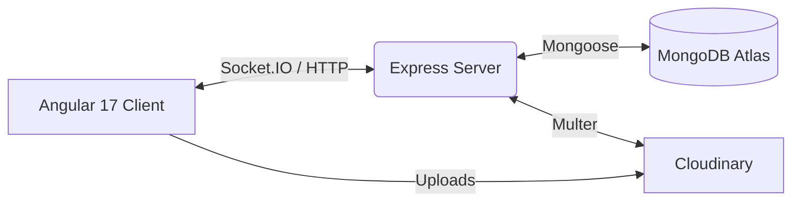

# 🎨 Tutorial 1: Project Setup & Architecture

📘 **What you'll learn:**
- How this monorepo is structured (Angular 17 + Express)
- How to run both servers locally
- Angular 17 Signals & Standalone components in action
- The Express API bootstrap flow

**Prerequisites:** Basic knowledge of TypeScript and web development.

> **📖 New terms in this chapter:**
> - **Monorepo:** A single repository containing multiple distinct projects (here, frontend and backend).
> - **Signals:** A new Angular feature for managing state reactively without complex RxJS observables.
> - **Standalone Components:** Angular components that don't need a bulky `NgModule` to work.

---

## 📘 Learn: System Architecture

Before we code, let's visualize how the entire Smart Wall Painter app connects:



---

## 🛠️ Build: Running Locally

Follow these step-by-step instructions to get the app running on your machine.

**Step 1. Configure the Backend**
Open the `express-server/` directory and create a `.env` file.
```text
// file: express-server/.env
PORT=5000
MONGODB_URI=your_mongo_url
JWT_SECRET=supersecret
CLOUDINARY_URL=your_cloudinary_url
```


**Step 2. Start the Backend Server**
Run the following in your terminal:
```bash
cd express-server
npm install
npm run dev
```

**Step 3. Start the Frontend Client**
Open a new terminal tab and start Angular:
```bash
cd angular-client
npm install
npm start
```


---

## 📘 Learn: The Code Setup

### Angular 17 Signals
In this app, we use Signals to manage state cleanly. Look at the canvas editor:

```typescript
// file: angular-client/src/app/features/canvas-editor/canvas-editor.component.ts
export class CanvasEditorComponent {
  activeTool = signal<'select' | 'pan' | 'draw' | 'wall' | 'erase'>('select');
  canUndo = signal(false);
}
```

### Express Bootstrap
Our backend is initialized cleanly with Express and Socket.IO working together on the same port:

```typescript
// file: express-server/src/index.ts
import express from 'express';
import http from 'http';
import { Server } from 'socket.io';

const app = express();
const server = http.createServer(app);
const io = new Server(server, { cors: { origin: '*' } });
```

---

## 🧪 Practice: Build It Yourself

**Goal:** Add a new Express route and call it from Angular.

1. Create a `/api/health` route in Express that returns `{ status: "ok" }`.
2. Create an Angular service that fetches this route on load.
3. Display the status on the dashboard!

**✅ Check yourself:**
- [ ] Did you restart the Express server after adding the route?
- [ ] Does navigating to `http://localhost:5000/api/health` work in your browser?
- [ ] Does the Angular UI update when the request finishes?