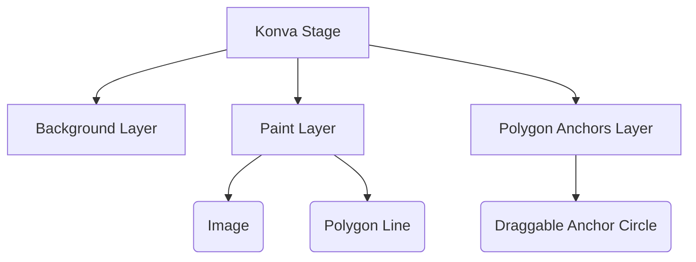

# 🎨 Tutorial 2: Canvas Engine (Konva.js)

📘 **What you'll learn:**
- Setting up the Konva Stage and Layers
- Building drawing tools and polygons
- Handling Undo/Redo logic natively

**Prerequisites:** [Tutorial 1: Project Setup & Architecture](./01-fundamentals.md)

> **📖 New terms in this chapter:**
> - **Konva.js:** An HTML5 2D canvas library that provides desktop-app-like interactivity (drag/drop, grouping).
> - **Stage/Layer:** Konva's hierarchy. The Stage holds Layers, and Layers hold Shapes.
> - **Imperative API:** Writing code that explicitly dictates *how* to do things step-by-step (unlike Angular templates which are declarative).

---

## 📘 Learn: Canvas Hierarchy



---

## 🛠️ Build: Drawing a Polygon

**Step 1. Initialize the Stage**
Open the canvas editor and bind Konva to an HTML `<div>`.

```typescript
// file: angular-client/src/app/features/canvas-editor/canvas-editor.component.ts
initStage() {
  const container = this.canvasContainer.nativeElement;
  this.stage = new Konva.Stage({
    container: container,
    width: container.offsetWidth,
    height: container.offsetHeight,
  });
  this.paintLayer = new Konva.Layer();
  this.stage.add(this.paintLayer);
}
```


**Step 2. Render Draggable Anchors**
To allow vertex editing, we render tiny blue circles on every polygon point.

```typescript
// file: angular-client/src/app/features/canvas-editor/canvas-editor.component.ts
renderPolygonAnchors(polygon: Konva.Line) {
  const points = polygon.points();
  for (let i = 0; i < points.length; i += 2) {
    const anchor = new Konva.Circle({
      x: points[i],
      y: points[i + 1],
      radius: 6,
      fill: '#3b82f6',
      draggable: true,
    });
    this.polygonAnchorsLayer.add(anchor);
  }
}
```

**Step 3. Implement Undo/Redo**
By tracking the last drawn shape, we can seamlessly pop it off the layer.

```typescript
// file: angular-client/src/app/features/canvas-editor/canvas-editor.component.ts
undo(): void {
  const children = this.paintLayer.getChildren();
  const lastStroke = children[children.length - 1];
  if (lastStroke) {
    this.redoStack.push(lastStroke);
    lastStroke.remove();
    this.paintLayer.batchDraw();
  }
}
```


---

## 🧪 Practice: Build It Yourself

**Goal:** Add a new Konva shape tool (e.g., an Ellipse) to the toolbar.

1. Add `'ellipse'` to the `activeTool` Signal.
2. Add a new button in the HTML template to select this tool.
3. In the `mousedown` listener on the stage, if the tool is `ellipse`, create a new `Konva.Ellipse`.

**✅ Check yourself:**
- [ ] Can you select the new tool?
- [ ] Does dragging the mouse create an ellipse of varying size?
- [ ] Does the Undo button successfully remove the newly drawn ellipse?