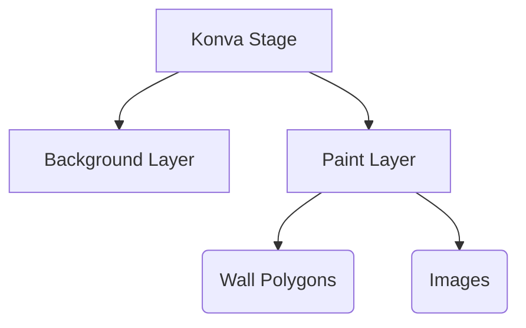

# 🎨 Tutorial 2: Canvas Engine (Konva.js - Easy Tanglish)


*“Super! App-a run pannitinga. Ippo Konva.js vachu canvas eppadi work aaguthu nu paapom. Idhu Photoshop mathiri drawing panna help pannum!”*

📘 **What you'll learn (Enna kethuka porom):**
- Konva Stage & Layers setup.
- Polygons draw panrathu.
- Undo/Redo logic.

**Prerequisites:** [Tutorial 1](./01-fundamentals.md) mudichurukanum.


> **📚 Official Links & Accounts (Munbe Ready Pannidunga!)**
> - **MongoDB Atlas:** Create a free cluster at [mongodb.com/cloud/atlas/register](https://www.mongodb.com/cloud/atlas/register). Get your `MONGODB_URI`.
> - **Cloudinary:** Create a free account at [cloudinary.com/users/register/free](https://cloudinary.com/users/register/free). Get your `CLOUDINARY_URL`.


---

## 📘 Learn: Hierarchy (Canvas structure)

Konva-la ellame oru tree mathiri than. Stage-kulla Layers, Layers-kulla shapes!



---

## 🛠️ Build: Step-by-Step Drawing

### Step 1. Stage Initialization
HTML-la oru div irukum, atha Konva Stage-a mathuvom.

```typescript
// file: angular-client/src/app/features/canvas-editor/canvas-editor.component.ts
initStage() {
  const container = this.canvasContainer.nativeElement;
  this.stage = new Konva.Stage({
    container: container,
    width: container.offsetWidth,
    height: container.offsetHeight,
  });
  
  // Layer add panniduvom!
  this.paintLayer = new Konva.Layer();
  this.stage.add(this.paintLayer);
}
```

### Step 2. Polygons and Anchors (Pulligal)
Wall varaiyurappa, end points-la chinna circle vaipom, apo than user athai drag panna mudiyum.

```typescript
// file: angular-client/src/app/features/canvas-editor/canvas-editor.component.ts
renderPolygonAnchors(polygon: Konva.Line) {
  const points = polygon.points();
  for (let i = 0; i < points.length; i += 2) {
    const anchor = new Konva.Circle({
      x: points[i],
      y: points[i + 1],
      radius: 6,
      fill: '#3b82f6',
      draggable: true, // Ithu romba mukkiyam!
    });
    this.polygonAnchorsLayer.add(anchor);
  }
}
```

---

## 🧪 Practice: Build It Yourself (Neengale Try Pannunga!)

**Goal:** Oru pudhu tool (Circle tool) add pannunga.

**✅ Check yourself:**
- [ ] Toolbar-la circle button add pannitingala?
- [ ] Drag pannum pothu circle draw aagutha?