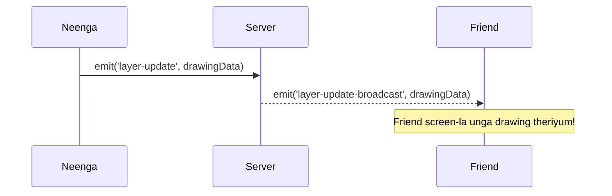

# 🎨 Tutorial 3: Realtime Collaboration (Socket.IO Tanglish)


*“Oru aal draw panna innonu aal screen-la athu automatic a theriyanum la? Athuku than Socket.IO! Real-time magic-a ippo paapom.”*

📘 **What you'll learn (Enna kethuka porom):**
- Socket.IO client-server communication.
- Angular-la events emit panrathu.

**Prerequisites:** [Tutorial 2](./02-canvas-engine.md) mudichurukanum.


> **📚 Official Links & Accounts (Munbe Ready Pannidunga!)**
> - **MongoDB Atlas:** Create a free cluster at [mongodb.com/cloud/atlas/register](https://www.mongodb.com/cloud/atlas/register). Get your `MONGODB_URI`.
> - **Cloudinary:** Create a free account at [cloudinary.com/users/register/free](https://cloudinary.com/users/register/free). Get your `CLOUDINARY_URL`.


---

## 📘 Learn: Flow Diagram



---

## 🛠️ Build: Code Setup

### Step 1. Express Server Handler
Backend-la data receive panni mathavangaluku send pannanum (Broadcast).

```typescript
// file: express-server/src/sockets/socketHandler.ts
export const setupSocketHandlers = (io: Server) => {
  io.on('connection', (socket) => {
    socket.on('layer-update', (data) => {
      // Ungala thavira matha ellarukum anupum!
      socket.to(data.projectId).emit('layer-update-broadcast', data);
    });
  });
};
```

### Step 2. Angular Receiver
Mathavanga varaiyuratha namma screen-la kaatanum.

```typescript
// file: angular-client/src/app/features/canvas-editor/canvas-editor.component.ts
this.socketService.on('layer-update-broadcast', (data) => {
  this.isRemoteUpdate = true; // Infinite loop varama thadukka idhu mukkiyam!
  this.loadCanvasData(data.layers);
});
```

---

## 🧪 Practice: Build It Yourself (Neengale Try Pannunga!)

**Goal:** Live Cursors add pannunga! User mouse move aagum pothu, friend screen-la antha cursor theriyanum.

**✅ Check yourself:**
- [ ] `mousemove` event-a server-ku anuppitingala?
- [ ] Friend screen-la cursor move aagutha?