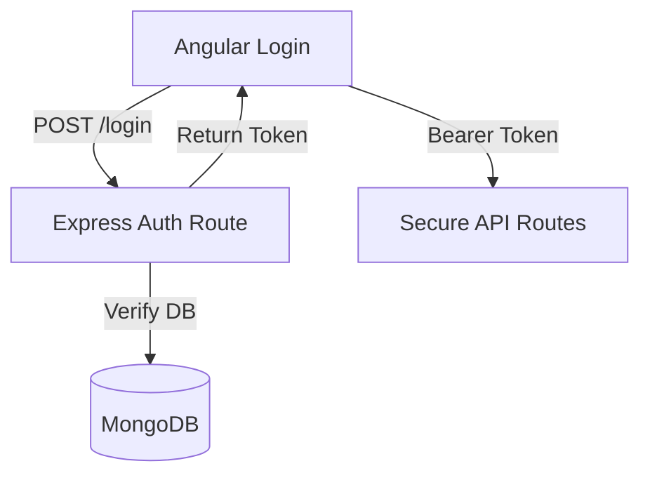

# 🎨 Tutorial 4: Backend Data & Auth (DB Setup - Tanglish)


*“App super-a work aaguthu, aana refresh pannina ellam poiduthe? Database-la save panna than permanent! JWT vechu secure pannuvom vanga.”*

📘 **What you'll learn (Enna kethuka porom):**
- MongoDB schema & Mongoose.
- JWT login authentication.
- Cloudinary-la image upload.

**Prerequisites:** [Tutorial 3](./03-realtime-collaboration.md).


> **📚 Official Links & Accounts (Munbe Ready Pannidunga!)**
> - **MongoDB Atlas:** Create a free cluster at [mongodb.com/cloud/atlas/register](https://www.mongodb.com/cloud/atlas/register). Get your `MONGODB_URI`.
> - **Cloudinary:** Create a free account at [cloudinary.com/users/register/free](https://cloudinary.com/users/register/free). Get your `CLOUDINARY_URL`.


---

## 📘 Learn: Auth Flow



---

## 🛠️ Build: Backend Code

### Step 1. Mongoose Schema
Project-a eppadi save panrathu nu define pannuvom.

```typescript
// file: express-server/src/models/Project.ts
const ProjectSchema = new Schema({
  name: { type: String, required: true },
  canvasState: { type: String, default: '[]' }
});
export const Project = mongoose.model('Project', ProjectSchema);
```

### Step 2. JWT Middleware
Yaru vena data-va maatha koodathu. Token irukavanga matum than API-a thoda mudiyum.

```typescript
// file: express-server/src/middleware/authMiddleware.ts
export const protect = (req: AuthenticatedRequest, res: Response, next: NextFunction) => {
  const token = req.headers.authorization?.split(' ')[1];
  if (!token) return res.status(401).json({ message: 'Token illaye boss!' });
  // Token valid-a nu check pannum...
  next();
};
```

---

## 🧪 Practice: Build It Yourself

**Goal:** Oru Pudhu API route `POST /api/comments` create panni athai JWT vechu protect pannunga.

**✅ Check yourself:**
- [ ] Postman-la token illama send pannina 401 error varutha?
- [ ] Token vachu send pannina DB-la save aagutha?