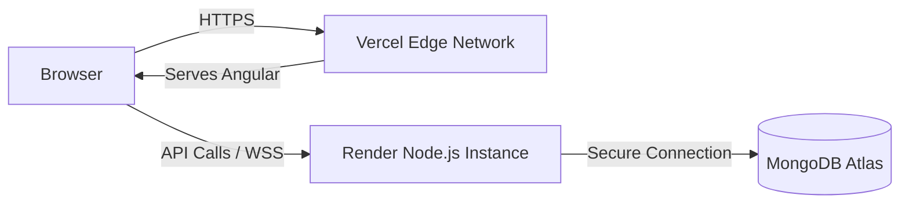

# 🎨 Tutorial 5: Advanced & Production Considerations

📘 **What you'll learn:**
- Deploying frontend to Vercel
- Deploying backend to Render
- Environment variable management

**Prerequisites:** [Tutorial 4: Backend Data & Auth](./04-backend-data-auth.md)

> **📖 New terms in this chapter:**
> - **Vercel:** A modern hosting platform optimized for frontend frameworks (like Angular).
> - **Render:** A cloud provider optimized for running backend services (like Node.js servers) via Docker or native runtimes.
> - **SPA (Single Page Application):** Web apps that dynamically rewrite the current page rather than loading new pages from a server.

---

## 📘 Learn: Production Architecture



---

## 🛠️ Build: Deployment Configs

**Step 1. Vercel SPA Routing**
Because Angular is an SPA, if a user refreshes the page on `/dashboard`, Vercel will throw a 404. We fix this by rewriting all requests to `index.html`.

```json
// file: angular-client/vercel.json
{
  "outputDirectory": "dist/angular-client/browser",
  "rewrites": [
    {
      "source": "/(.*)",
      "destination": "/index.html"
    }
  ]
}
```


**Step 2. Render Build Command**
Render builds Node apps automatically, but it defaults to a production environment that strips out TypeScript compiler dependencies. We force it to keep them!

In your Render dashboard settings:
```bash
# Build Command
npm install --legacy-peer-deps && npm run build

# Start Command
npm start
```

**Step 3. Environment Variable Routing**
Your frontend needs to know to talk to Render, not localhost.

```typescript
// file: angular-client/src/app/services/socket.service.ts
import { isDevMode } from '@angular/core';

@Injectable({ providedIn: 'root' })
export class SocketService {
  private serverUrl = isDevMode() 
    ? 'http://localhost:5000' 
    : 'https://wall-painter.onrender.com';
    
  // ...
}
```


---

## 🧪 Practice: Build It Yourself

**Goal:** Deploy your fork to Vercel + Render and verify env vars work.

1. Connect your GitHub repo to Render and deploy the Express app.
2. Connect your GitHub repo to Vercel and deploy the Angular app.
3. Test a full round-trip drawing operation on the live URLs.

**✅ Check yourself:**
- [ ] Does the Vercel site load without 404 errors?
- [ ] Does drawing on the Vercel site emit socket events to the Render backend?
- [ ] Can a friend on a different computer see your drawings in real-time?