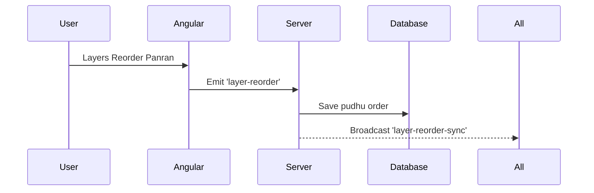

# 🎨 Tutorial 6: Capstone Project (Final Exam - Tanglish)


*“Idhu thaan unga final project! Oru full feature-a end-to-end eppadi build panrathu nu paapom: Layers Panel!”*

📘 **What you'll learn (Enna kethuka porom):**
- UI, Backend, Database nu munnathiyum connect panni oru mass feature build panrathu.

**Prerequisites:** Tutorial 1 to 5 completely understand aagirkanum.

---

## 📘 Learn: The Goal

Oru list of layers UI-la kaatanum. Atha drag panni reorder pannina, DB-la update aagi mathavangalukum live-a sync aaganum.



---

## 🛠️ Build: Steps to Follow

### Step 1. Angular Component
Layers list panna oru component ezhuthunga.

```html
<!-- file: angular-client/src/app/features/canvas-editor/components/layers-panel/layers-panel.html -->
<div class="layer-list">
  @for (layer of canvasLayers(); track layer.id) {
    <div>{{ layer.name }}</div>
  }
</div>
```

### Step 2. Express Route
Backend-la reorder event vandha, atha receive panni save pannanum.

```typescript
// file: express-server/src/sockets/socketHandler.ts
socket.on('layer-reorder', (newOrder) => {
  // Save to DB...
  socket.to(projectId).emit('layer-reorder-sync', newOrder);
});
```

---

## 🧪 Practice: Finish it!

**Goal:** Intha full flow-va mudinga.

**✅ Check yourself:**
- [ ] Layer-a drag panni mela pota, athu drawing-la front-la theriyutha?
- [ ] Innonu browser open panna antha change live-a varutha?

*“Awesome! Neenga ippo oru pro MEAN stack developer aagitinga! Vaazhthukkal!”*