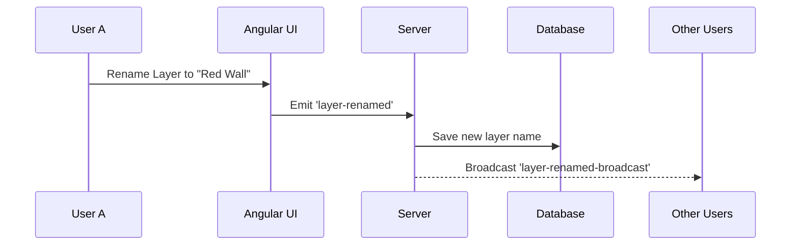

# 🎨 Tutorial 6: Capstone Project

📘 **What you'll learn:**
- Combining everything from Chapters 1-5 into a single massive feature.
- End-to-end full-stack development workflow.

**Prerequisites:** Complete Tutorials 1 through 5.

> **📖 New terms in this chapter:**
> - **End-to-End (E2E):** Building a feature that touches the database, backend routes, frontend UI, and real-time syncing.

---

## 📘 Learn: The Capstone Goal

We are going to build a **Layers Panel with Realtime Sync**. This allows users to see exactly which objects are on the canvas, rename them, and reorder them (like Photoshop!).



---

## 🛠️ Build: The Capstone

**Step 1. Database Update**
We need to ensure the MongoDB `Project` schema supports robust layer names. (It currently just saves a raw JSON string of Konva data).

```typescript
// file: express-server/src/models/Project.ts
// Add a new field to track layer metadata if necessary!
```

**Step 2. The Angular UI Component**
Create a new standalone component that loops through the Konva nodes and displays them in a list.

```typescript
// file: angular-client/src/app/features/canvas-editor/components/layers-panel/layers-panel.component.ts
@Component({
  selector: 'app-layers-panel',
  standalone: true,
  template: `
    <div class="layers-panel">
      @for (layer of canvasLayers(); track layer._id) {
        <div class="layer-item">{{ layer.name() }}</div>
      }
    </div>
  `
})
export class LayersPanelComponent {
  canvasLayers = signal<Konva.Node[]>([]);
}
```


**Step 3. Wiring up the Socket**
When a user drags a layer up or down in the panel, emit the event!

```typescript
// file: angular-client/src/app/services/socket.service.ts
emitLayerReorder(projectId: string, newOrder: any[]) {
  this.socket.emit('layer-reorder', { projectId, newOrder });
}
```


---

## 🧪 Practice: Build It Yourself

**Goal:** Finish the Capstone Project on your own!

1. Implement drag-and-drop reordering in the Angular template.
2. Hook up the backend to save the new order.
3. Deploy the final capstone to Vercel/Render!

**✅ Check yourself:**
- [ ] Can you drag a layer up and see it jump to the front of the canvas?
- [ ] Do other connected users see the reorder instantly?
- [ ] Are the names saved to MongoDB successfully?

### 🚀 What's Next?
Congratulations! You've mastered full-stack architectural design. Consider adding these features next:
- Role-based permissions (Viewer vs Editor).
- PDF / Image exporting pipeline.
- AI-based texture generation!