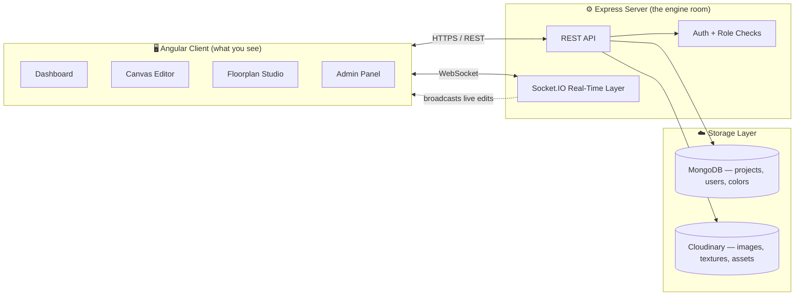
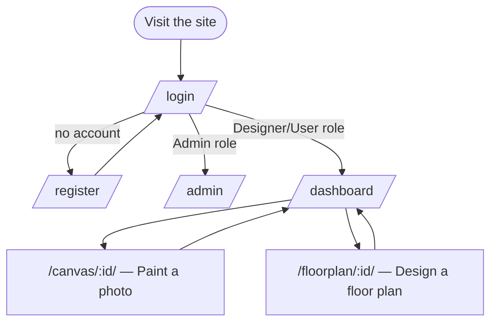
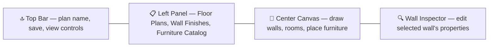
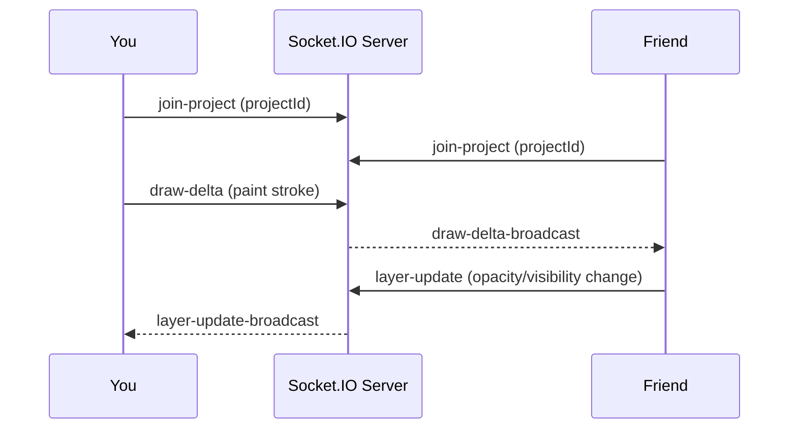

<div align="center">

# 🎨 Smart Wall Painter — Complete Application Guide

### From "What is this app?" to "How do I deploy this in production?"

<p>
  
  
  
</p>

**Live demo:** [wall-painter-eta.vercel.app](https://wall-painter-eta.vercel.app)
**Source:** [github.com/Nandhini303/wall_painter](https://github.com/Nandhini303/wall_painter)

</div>

---

## 📚 Table of Contents

1. [What Is This App? (No Tech Knowledge Needed)](#1--what-is-this-app-no-tech-knowledge-needed)
2. [How the App Is Built (Architecture)](#2--how-the-app-is-built-architecture)
3. [Every Page, Explained](#3--every-page-explained)
   - [3.1 Login Page](#31--login-page)
   - [3.2 Register Page](#32--register-page)
   - [3.3 Dashboard Page](#33--dashboard-page)
   - [3.4 Canvas Editor Page](#34--canvas-editor-page-the-heart-of-the-app)
   - [3.5 Floorplan Studio Page](#35--floorplan-studio-page)
   - [3.6 Admin Panel](#36--admin-panel)
4. [Step-by-Step Tutorial: Your First Design (Beginner)](#4--step-by-step-tutorial-your-first-design-beginner)
5. [How Real-Time Collaboration Works (Intermediate)](#5--how-real-time-collaboration-works-intermediate)
6. [Roles & Permissions](#6--roles--permissions)
7. [Backend API Reference (Advanced)](#7--backend-api-reference-advanced)
8. [Project Folder Structure](#8--project-folder-structure)
9. [Local Setup — Every Skill Level](#9--local-setup--every-skill-level)
10. [Deployment (Production)](#10--deployment-production)
11. [Glossary](#11--glossary-for-non-technical-readers)
12. [FAQ & Troubleshooting](#12--faq--troubleshooting)

---

## 1. 🧠 What Is This App? (No Tech Knowledge Needed)

Imagine you're about to repaint your living room, but you're not sure if "sage green" will actually look good on that wall. Instead of buying paint and testing it directly on the wall, **Smart Wall Painter lets you upload a photo of your room and "repaint" it digitally** — in seconds, with any color, texture, or wallpaper you like.

It's like Instagram filters, but instead of filtering a selfie, you're recoloring a wall in a photo of your room — and you can invite a friend, family member, or your interior designer to see the changes **live**, as if you were both looking at the same screen.

> 💡 **Think of it as:** Microsoft Paint + Google Docs (live collaboration) + a paint store's color catalog, all combined into one tool.

</br>


*A room like this is exactly what you'd upload — the app lets you "repaint" walls like this one without touching a single paintbrush.*

### Who is it for?
| Person | What they get out of it |
|---|---|
| 🏠 Homeowner | Try paint colors before buying a single can |
| 🎨 Interior Designer | Present multiple design options to clients live, in one call |
| 🏢 Paint Retailer | Let customers preview products in their own homes (catalog integration) |
| 🏗️ Architect | Sketch floor plans and assign wall finishes room by room |

---

## 2. 🏗️ How the App Is Built (Architecture)

Under the hood, the app has two separate "brains" that talk to each other:



**In plain English:**
- The **Angular Client** is everything you click, drag, and paint on.
- The **Express Server** is the logic layer — it checks who you are, saves your work, and manages permissions.
- **MongoDB** is the filing cabinet that remembers your projects, users, and paint colors.
- **Cloudinary** is the photo album that stores your uploaded room photos, textures, and exported designs.
- **Socket.IO** is the "telephone wire" that instantly tells every other person looking at the same project, "hey, something just changed!"

---

## 3. 🧭 Every Page, Explained

The app has **6 pages** (routes). Here's the map:



---

### 3.1 🔐 Login Page

**Route:** `/login`

This is the front door. It asks for your **email** and **password**, and offers:
- 👁️ **Show/Hide password toggle** — click the eye icon to check you typed it correctly
- ☑️ **Remember Me** — keeps you signed in on this device
- 🔗 A link to the **Register** page if you're new

**Behind the scenes:** when you submit, the app checks your role. **Admins are redirected straight to the Admin Panel**; everyone else lands on the **Dashboard**.

---

### 3.2 📝 Register Page

**Route:** `/register`

A simple sign-up form (first name, last name, email, password). Every new account starts with the **User** role by default — an Admin can upgrade you later (see [Roles & Permissions](#6--roles--permissions)).

---

### 3.3 🗂️ Dashboard Page

**Route:** `/dashboard` (the page you land on after login)

Think of this as your **project gallery** — every room you've ever uploaded lives here.

#### What you can do on this page:

| Feature | What it does |
|---|---|
| 🏢 **Workspaces** | Group your projects into "Personal," "Team," or "Client" workspaces — like folders for different contexts. Click your workspace name (top-left) to switch or create a new one. |
| ➕ **Create Project** | Click "New Project," name it, and optionally attach a room photo right away |
| 📤 **Drag & Drop Upload** | Drag any room photo straight onto the dashboard to instantly create a new project |
| 📋 **Paste From Clipboard** | Copied a screenshot? Just hit `Ctrl+V` anywhere on the dashboard — it becomes a new project automatically |
| 🔍 **Search** | Type to instantly filter your project list by name |
| 🗃️ **Grid / List View** | Toggle between a visual thumbnail grid and a compact list |
| ⭐ **Favorites** | Star any project to pin it under the "Favorites" filter |
| 🕒 **Recent Filter** | Show only projects updated in the last 7 days |
| ↕️ **Sort** | Newest, oldest, or alphabetical (A–Z) |
| ✏️ **Inline Rename** | Click the pencil icon on any project card to rename it without opening it |
| 🗑️ **Delete (single or all)** | Remove one project, or wipe every project in the current workspace — both ask for confirmation first |
| 🔔 **Notifications Bell** | Quick list of recent activity |
| 👤 **User Menu** | Your profile, theme (light/dark), and logout |
| ⌨️ **Command Palette** | A search-everything shortcut (like `Ctrl+K` in VS Code) to jump to any project or action instantly |

> 🟢 **Beginner tip:** The fastest way to start is to drag a photo of your room straight onto this page. You don't even need to click anything first.

---

### 3.4 🖌️ Canvas Editor Page (the heart of the app)

**Route:** `/canvas/:id` — opened whenever you click into a project

This is where the actual "repainting" happens. It's built on **Konva.js**, a canvas engine that treats every wall, brush stroke, and shape as an editable object (like layers in Photoshop).

#### The Toolbar

| Tool | Icon | What it's for |
|---|---|---|
| **Select** | 🖱️ | Click and move existing shapes/layers |
| **Magic Wand** | 🪄 | Click once on a wall — it automatically detects the wall's edges and selects it, like the "magic wand" tool in Photoshop |
| **AI Wand** | ✨ | Same idea, but uses a smarter AI model to detect complex wall shapes (corners, shadows, windows) more accurately |
| **Polygon** | ⬠ | Manually click point-by-point to trace an exact wall outline yourself |
| **Lasso** | 🎯 | Freehand-draw around an area to select it |
| **Brush** | 🖌️ | Paint freely, stroke by stroke |
| **Eraser** | 🧽 | Remove paint from an area |
| **Eyedropper** | 💧 | Click any pixel in the photo to "pick" that exact color |
| **Hand (Pan)** | ✋ | Click-drag to move around when you're zoomed in |

#### Side Panels

- **🎨 Color Swatch Panel** — a curated palette grid; click a swatch to set it as your active paint color
- **🖍️ Custom Color Popover** — pick *any* color using a color wheel/hex input, beyond the preset swatches
- **🧱 Texture Library Panel** — apply real material finishes (matte, gloss, brick, wood paneling, wallpaper patterns) instead of flat color
- **📦 Asset Library Panel** — drag in furniture, décor, or design elements onto the canvas
- **⚙️ Tool Properties Panel** — fine-tune the active tool (brush size, hardness, opacity, tolerance)

#### Top Bar Controls

- 🔍 **Zoom In / Out** — precision control over the canvas view
- ↩️ **Undo / Redo** — full history stack, so mistakes are never permanent
- 🔲 **Grid Toggle** — overlay a grid for alignment
- 🪟 **Split View** — compare before/after side-by-side
- 💾 **Save Status Indicator** — shows *Saved* / *Saving…* / *Unsaved* live, with **auto-save** running in the background (debounced, so it doesn't save on every single pixel)
- ⬇️ **Export** — download your finished design as an image
- 🔗 **Share** — generate a shareable link so someone else can view or co-edit the project live
- 🚀 **Publish** — mark the project as finished/final

#### Room Templates
If you don't have your own photo yet, the app ships with ready-made sample rooms so you can try the tool immediately:

<table>
<tr>
<td><br/><sub>Cozy Living Room</sub></td>
<td><br/><sub>Modern Bedroom</sub></td>
<td><br/><sub>Minimalist Kitchen</sub></td>
</tr>
</table>

> 🟡 **Intermediate tip:** Use the **Magic Wand** for flat, evenly-lit walls (fast and accurate). Switch to **Polygon** for tricky corners, shadows, or when the AI selects too much/too little.

---

### 3.5 📐 Floorplan Studio Page

**Route:** `/floorplan/:id`

While the Canvas Editor works on a **photo**, the Floorplan Studio works on a **top-down 2D layout** — for planning a whole room (or house) from scratch rather than editing an existing photo.

**Layout of this page:**




*The Floorplan Studio works with a bird's-eye layout like an architect's blueprint, rather than a straight-on room photo.*

- **Floor Plans accordion** — switch between the current plan and defined rooms
- **Wall Finishes accordion** — apply the same paint/texture catalog used in the Canvas Editor, but to floor-plan walls
- **Furniture Catalog accordion** — drag in furniture pieces to populate the layout
- **Wall Inspector Panel** — click any wall segment to edit its length, finish, and properties in detail

---

### 3.6 🛡️ Admin Panel

**Route:** `/admin` — only visible to accounts with the **Admin** role

Organized into three groups in the sidebar:

**Core Administration**
- 📊 **Dashboard** — platform-wide activity overview
- 👥 **Users** — view every account, invite new users by email, and change roles (User ↔ Designer ↔ Admin)

**Content & Studio Assets**
- 🖼️ **Room Templates** — manage the sample rooms shown to all users (add, edit, publish/unpublish, tag by category)
- 💾 **Storage & Assets** — see how much Cloudinary storage is used, and manage API keys for integrations
- 🎨 **Color Library** — add/edit the official paint color catalog (with brand info)
- 🧱 **Textures & Surfaces** — manage the texture catalog (matte, gloss, brick, wallpaper, etc.)
- 🖌️ **Brush Library** — create reusable brush presets (size, hardness, opacity) available to every user

**Settings & Account**
- 💳 **Billing & Plans** — subscription plan and invoice history
- 👤 **My Profile** — the admin's own account details
- ❓ **Help & Docs** — support/reference material

> 🔴 **Advanced tip:** Every admin action (role change, template edit, etc.) is written to an **Audit Log** (`/admin/audit-logs`), so there's always a paper trail of who changed what.

---

## 4. 🚶 Step-by-Step Tutorial: Your First Design (Beginner)

1. **Open the app** → land on the [Login page](#31--login-page).
2. **No account?** Click "Sign up," fill in your name/email/password, then log back in.
3. You'll arrive at the **[Dashboard](#33--dashboard-page)**.
4. **Drag a photo of your room** straight onto the dashboard (or click **New Project** → upload a photo → give it a name).
5. The app automatically opens the **[Canvas Editor](#34--canvas-editor-page-the-heart-of-the-app)** for your new project.
6. Click the **Magic Wand tool (🪄)**, then click once directly on the wall you want to change.
7. Pick a color from the **Color Swatch Panel** (or use the **Eyedropper** to copy a color from elsewhere in the photo).
8. Watch the wall repaint instantly — no need to hit "save," the app **auto-saves** for you (watch the status indicator turn to *Saved*).
9. Want a second opinion? Click **Share** at the top, copy the link, and send it to a friend — you'll both see edits appear live.
10. Happy with it? Click **Export** to download the final image, or **Publish** to mark the project as complete.

---

## 5. 🔄 How Real-Time Collaboration Works (Intermediate)

When two people open the same project, here's what happens behind the scenes:



**In plain English:** everyone viewing the same project joins a private "room" on the server. Any paint stroke or layer change you make is sent to the server as a small "delta" (just the change, not the whole image — this keeps it fast), and the server instantly forwards it to everyone else in that same room. Nobody needs to refresh the page.

---

## 6. 👥 Roles & Permissions

| Role | Can do |
|---|---|
| **User** | Create/edit their own projects, use the Canvas Editor and Floorplan Studio |
| **Designer** | Everything a User can do (currently the same access level as User in the API; distinguished for future client-facing features) |
| **Admin** | Everything above **plus** full access to the [Admin Panel](#36--admin-panel): manage users, catalog content, view audit logs, and view analytics |

Roles are enforced on the backend (not just hidden in the UI) — every Admin API route checks the requester's role before responding, so a non-admin can't access admin data even by guessing a URL.

---

## 7. 🔌 Backend API Reference (Advanced)

Base path: `/api` (all routes below are prefixed with this)

### Auth (`/auth`) — public
| Method | Path | Purpose |
|---|---|---|
| POST | `/auth/register` | Create a new account |
| POST | `/auth/login` | Log in, receive a JWT token |

### Projects (`/projects`) — requires login
| Method | Path | Purpose |
|---|---|---|
| POST | `/projects` | Create a project (optionally with an image upload) |
| GET | `/projects` | List your projects |
| GET | `/projects/:id` | Get one project's full detail |
| PUT | `/projects/:id` | Update a project (rename, save canvas state, etc.) |
| PUT | `/projects/:id/publish` | Mark a project as published |
| DELETE | `/projects/:id` | Delete one project |
| DELETE | `/projects` | Delete **all** of your projects |

### Catalog (`/catalog`) — requires login; write access is Admin-only
| Method | Path | Purpose |
|---|---|---|
| GET | `/catalog/colors` | Fetch the paint color catalog |
| GET | `/catalog/brands` | Fetch paint brands |
| GET | `/catalog/textures` | Fetch the texture catalog |
| POST | `/catalog/colors` | *(Admin)* Add a new color |
| POST | `/catalog/textures` | *(Admin)* Add a new texture |

### Admin (`/admin`) — Admin role required
| Method | Path | Purpose |
|---|---|---|
| GET | `/admin/users` | List all users |
| POST | `/admin/users/invite` | Invite a new user by email |
| PUT | `/admin/users/:id/role` | Change a user's role |
| GET | `/admin/audit-logs` | View the audit trail |
| GET | `/admin/analytics` | Platform-wide analytics |
| GET | `/admin/storage` | Cloudinary storage usage |

### Uploads (`/uploads`) — requires login
| Method | Path | Purpose |
|---|---|---|
| POST | `/uploads/image` | Upload a room photo to Cloudinary |
| POST | `/uploads/texture` | Upload a texture asset |
| GET | `/uploads` | List uploaded assets |
| DELETE | `/uploads/:publicId` | Delete an asset |

### Real-time events (Socket.IO, not REST)
| Event | Direction | Purpose |
|---|---|---|
| `join-project` | Client → Server | Join a project's live "room" |
| `leave-project` | Client → Server | Leave the room |
| `draw-delta` → `draw-delta-broadcast` | Client → Server → Others | Broadcast a paint change |
| `layer-update` → `layer-update-broadcast` | Client → Server → Others | Broadcast a layer property change |

> A ready-to-import **Postman collection** (`postman_collection.json`) is included in the repo root if you want to test these endpoints without writing any code.

---

## 8. 📁 Project Folder Structure

```
wall_painter/
├── angular-client/                  # Frontend (Angular 17+)
│   └── src/app/
│       ├── features/
│       │   ├── auth/                # Login + Register pages
│       │   ├── dashboard/           # Project gallery page
│       │   ├── canvas-editor/       # Main painting workspace
│       │   │   └── components/      # Toolbar sub-panels
│       │   ├── floorplan-studio/    # 2D floor-plan workspace
│       │   │   └── components/
│       │   └── admin/               # Admin panel
│       ├── services/                # API + state services (one per domain)
│       ├── guards/                  # Route protection (auth + admin)
│       └── components/              # Shared UI (modals, toasts, command palette)
│
├── express-server/                  # Backend (Node.js + Express)
│   └── src/
│       ├── controllers/             # Request handlers
│       ├── services/                # Business logic
│       ├── repositories/            # Database queries
│       ├── models/                  # MongoDB schemas
│       ├── routes/                  # API route definitions
│       ├── middleware/              # Auth, RBAC, error handling, uploads
│       ├── sockets/                 # Socket.IO real-time handlers
│       └── config/                  # DB, Cloudinary, seed data
│
├── docker-compose.yml               # One-command local full-stack setup
├── postman_collection.json          # Ready-made API test collection
├── landing_page_design.html         # Marketing landing page
└── README.md
```

---

## 9. 🛠️ Local Setup — Every Skill Level

### 🟢 Beginner: Just want to see it running?

**Prerequisites:** [Node.js](https://nodejs.org/en/) installed.

```sh
git clone https://github.com/Nandhini303/wall_painter.git
cd wall_painter

# Terminal 1 — backend
cd express-server
npm install
npm run dev

# Terminal 2 — frontend (new terminal window)
cd angular-client
npm install
npm start
```

Open `http://localhost:4200` in your browser. That's it!

### 🟡 Intermediate: Setting up your own database & storage

Create a `.env` file inside `express-server/`:

```env
PORT=5000
MONGODB_URI=your_mongodb_connection_string
JWT_SECRET=your_jwt_secret_key
CLOUDINARY_CLOUD_NAME=your_cloud_name
CLOUDINARY_API_KEY=your_api_key
CLOUDINARY_API_SECRET=your_api_secret
```

Then, optionally seed the database with starter data (sample colors/textures):

```sh
cd express-server
npm run seed
```

### 🔴 Advanced: One-command full stack with Docker

The repo ships with a `docker-compose.yml` that builds and runs **both** services together:

```sh
docker-compose up --build
```

This starts:
- The API server on `http://localhost:5000`
- The Angular client on `http://localhost:80`

> ⚠️ The committed `docker-compose.yml` contains placeholder credentials — replace `MONGODB_URI`, `JWT_SECRET`, and the Cloudinary values with your own before using this in anything beyond local testing.

---

## 10. 🚀 Deployment (Production)

The project is pre-configured for a split deployment:

| Service | Where | Config file |
|---|---|---|
| Frontend (`angular-client`) | [Vercel](https://vercel.com) | `angular-client/vercel.json` |
| Backend (`express-server`) | [Render](https://render.com) | — |

**General flow:**
1. Push your code to GitHub.
2. Connect the repo to Vercel, setting the **root directory** to `angular-client`.
3. Connect the repo to Render (or similar) as a Node web service, setting the **root directory** to `express-server`, with `npm run build` and `npm start` as the build/start commands.
4. Add your production environment variables (MongoDB URI, JWT secret, Cloudinary keys) in each platform's dashboard — never commit real secrets to the repo.
5. Update the Angular client's API base URL to point at your deployed backend.

---

## 11. 📖 Glossary (for Non-Technical Readers)

| Term | Plain-English meaning |
|---|---|
| **Frontend** | The part of the app you see and click on |
| **Backend / API** | The invisible engine that saves data and enforces rules |
| **Database (MongoDB)** | Where all your projects, accounts, and colors are permanently stored |
| **Cloud storage (Cloudinary)** | Where uploaded photos and textures live |
| **JWT / Token** | A digital "wristband" your browser holds after login, proving you're allowed in |
| **Socket / Real-time** | A live, always-open connection that lets changes appear instantly without refreshing |
| **Route** | A specific page/URL in the app, like `/dashboard` |
| **API endpoint** | A specific "address" the frontend asks the backend for data |
| **Auto-save (debounced)** | The app waits a moment after you stop typing/painting before saving, instead of saving on every keystroke |

---

## 12. ❓ FAQ & Troubleshooting

**Q: I ran `npm start` but the page is blank.**
Make sure the backend (`npm run dev` in `express-server`) is running *first*, in a separate terminal — the frontend needs it to load your projects.

**Q: My uploaded image isn't showing up.**
Check that your Cloudinary environment variables are correctly set in `express-server/.env`. Without valid Cloudinary credentials, uploads will silently fail.

**Q: I can't see the Admin Panel.**
Your account role must be `Admin`. Ask an existing admin to promote your account via **Admin → Users → change role**, or update it directly in MongoDB if you're setting up a fresh instance.

**Q: The Magic Wand selected too much of the wall.**
Switch to the **AI Wand** for tricky lighting/shadows, or manually trace the wall with the **Polygon** tool for full control.

**Q: Two people editing the same project see different things.**
Make sure both browser tabs are actually connected (check your network — Socket.IO needs a live WebSocket connection, which some restrictive corporate networks block).

---

<div align="center">

**Built with ❤️ by Nandhini** • [GitHub Profile](https://github.com/Nandhini303)

</div>
