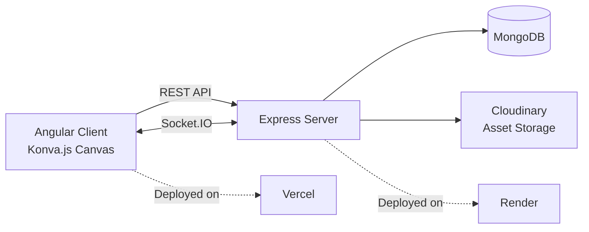

# 🎨 Tutorial Painter — Learn Full-Stack Real-Time Apps by Building Smart Wall Painter

[](https://angular.io)
[](https://expressjs.com)
[](https://konvajs.org)
[](https://socket.io)
[](https://www.mongodb.com)
[](#-license)

> A **step-by-step, beginner-to-advanced tutorial series** that teaches you how to build a real-time, collaborative digital canvas application — using the actual [`wall_painter`](https://github.com/Nandhini303/wall_painter) codebase as the live reference project.

Instead of toy examples, every chapter here is grounded in **real, working code** from a production-style app: Angular 17 + Konva.js on the frontend, Express + Socket.IO + MongoDB + Cloudinary + JWT on the backend.

---

## 📖 Table of Contents

- [Why This Tutorial Series](#-why-this-tutorial-series)
- [What You'll Build](#-what-youll-build)
- [Tech Stack](#-tech-stack)
- [Learning Path](#-learning-path)
- [Architecture Overview](#-architecture-overview)
- [Getting Started](#-getting-started)
- [How to Use This Repo](#-how-to-use-this-repo)
- [Practice & Capstone](#-practice--capstone)
- [Contributing](#-contributing)
- [Author](#-author)
- [License](#-license)

---

## 🚀 Why This Tutorial Series

Most tutorials teach concepts in isolation — a Socket.IO demo here, a canvas-drawing demo there. This series is different:

- Every chapter maps to **real files in a real repo**, not toy snippets
- You go from **fundamentals → canvas rendering → real-time sync → backend/auth → production deployment**
- Each chapter ends with **practice problems** you build yourself, not just read
- A final **capstone project** ties every concept together into one real feature

If you can follow along and finish the capstone, you'll understand how a full-stack, real-time, collaborative web app is actually built and shipped — not just how the pieces work in theory.

---

## 🖼️ What You'll Build

By the end of this series, you'll have implemented (in your own fork of `wall_painter`):

- ✏️ An interactive drawing canvas (polygons, wall textures, vertex editing)
- ⚡ Real-time multi-user collaboration via Socket.IO
- 🔐 JWT-based authentication with protected API routes
- ☁️ Cloud asset uploads via Cloudinary
- 🗄️ MongoDB-backed data models with full CRUD
- 🚀 A deployed, production-ready app (Vercel + Render)

---

## 🛠️ Tech Stack

| Layer | Technology |
|---|---|
| Frontend Framework | Angular 17+ (Standalone Components, Signals) |
| Canvas Engine | Konva.js |
| Styling | SCSS, Open Color |
| Real-Time Layer | Socket.IO |
| Backend | Node.js + Express.js |
| Database | MongoDB |
| Asset Storage | Cloudinary |
| Auth | JWT + bcrypt |
| Hosting | Vercel (client) · Render (server) |

---

## 🧭 Learning Path

| # | Chapter | You'll Learn | Practice Problem |
|---|---|---|---|
| 01 | [Fundamentals](./01-fundamentals.md) | Project structure, Angular 17 basics, Express bootstrap | Add a new Express route and call it from Angular |
| 02 | [Canvas Engine](./02-canvas-engine.md) | Konva.js Stage/Layer/Shape, drawing tools, coordinate handling | Add a new Konva shape tool (e.g. ellipse) to the toolbar |
| 03 | [Real-Time Collaboration](./03-realtime-collaboration.md) | Socket.IO client/server setup, event flow, conflict handling | Broadcast a custom event (e.g. "user typing" indicator) |
| 04 | [Backend, Data & Auth](./04-backend-data-auth.md) | MongoDB schema design, JWT auth flow, Cloudinary uploads | Add a new protected collection + CRUD route with JWT check |
| 05 | [Advanced & Production](./05-advanced-production.md) | Deployment config, env management, performance, CI | Deploy your fork to Vercel + Render and verify env vars |
| 06 | [Capstone Project](./06-capstone-project.md) | Combining everything into one real feature end-to-end | Ship a full feature: e.g. a real-time synced Layers Panel |

Each chapter includes:
- 📘 **Learn** — the concept, explained plainly, with a mini glossary for new terms
- 🛠️ **Build** — numbered, copy-along steps referencing exact files and code
- 🧪 **Practice** — exercises you complete on your own
- ✅ **Check yourself** — a checklist to confirm you got it right

---

## 🏗️ Architecture Overview



---

## 🧰 Getting Started

Clone the reference project you'll be following along with:

```bash
git clone https://github.com/Nandhini303/wall_painter.git
cd wall_painter
```

**Backend:**
```bash
cd express-server
npm install
npm run dev
```
*(Set up `.env` with your MongoDB URI, JWT secret, and Cloudinary credentials first.)*

**Frontend:**
```bash
cd angular-client
npm install
npm start
```

Then open `http://localhost:4200` and start with **[Chapter 01](./01-fundamentals.md)**.

---

## 📚 How to Use This Repo

1. Read chapters in order — each builds on the last.
2. Keep `wall_painter` open in your editor alongside each chapter so you can follow file references directly.
3. Don't skip the **Practice** sections — they're where the concepts actually stick.
4. Struggling? Re-read the mini glossary box at the top of the chapter before moving on.

---

## 🧪 Practice & Capstone

Every chapter has hands-on exercises scoped to that chapter's concept, escalating in difficulty. The series culminates in **[Chapter 06: Capstone Project](./06-capstone-project.md)**, where you'll build a complete new feature — canvas interaction, real-time sync, backend persistence, auth protection, and deployment — from scratch.

---

## 🤝 Contributing

Found an unclear explanation, a broken step, or want to add a new practice problem? PRs and issues are welcome. Please keep additions consistent with the existing chapter format (📘 🛠️ 🧪 ✅ sections).

---

## 👩‍💻 Author

Tutorial series by **[Nandhini](https://github.com/Nandhini303)**, based on her original project **[wall_painter](https://github.com/Nandhini303/wall_painter)**.

---

## 📄 License

MIT — free to learn from, fork, and build on.
